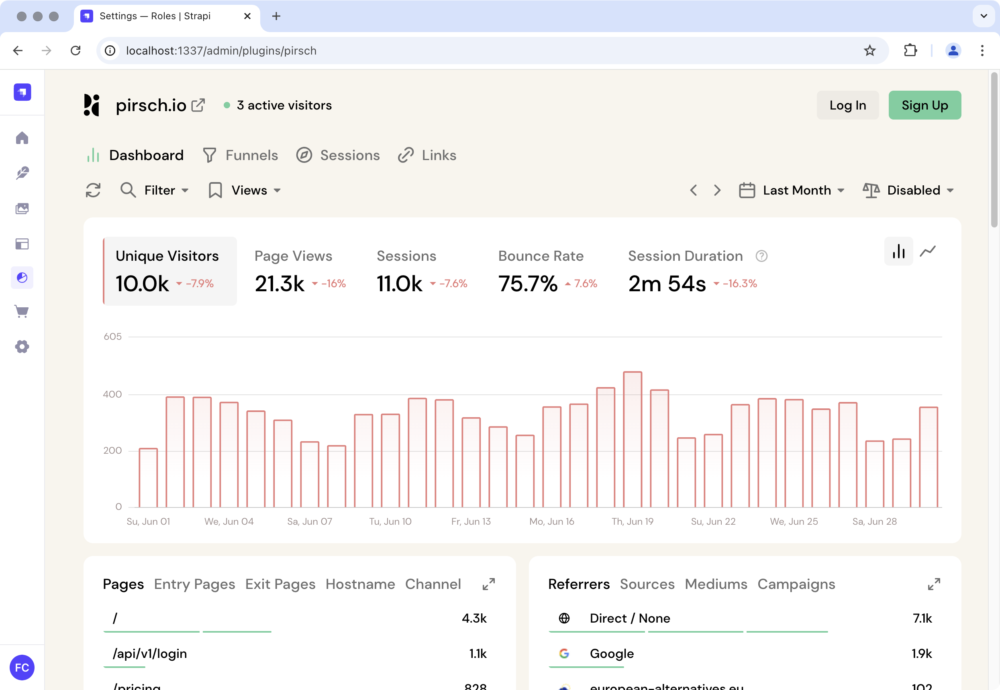

# Strapi Plugin for Pirsch

A Strapi v5 plugin that provides an embedded Pirsch analytics dashboard within the Strapi admin interface.



## Installation

```bash
npm install strapi-plugin-pirsch
```

## Configuration

Add to your plugins.ts

```
  'pirsch': {
    enabled: true,
  },
```

### Configure Dashboard URL

1. Navigate to **Settings** → **Pirsch Analytics** in your Strapi admin
2. Enter your [Pirsch Access Link](https://docs.pirsch.io/advanced/access#public-access) (e.g., `https://your-dashboard.pirsch.io`)
3. Click **Save Settings**

### Content Security Policy (Optional)

If you have the `strapi::security` middleware enabled, update your `config/middlewares.ts`:

```typescript
export default [
  {
    name: 'strapi::security',
    config: {
      contentSecurityPolicy: {
        directives: {
          'frame-src': ["'self'", 'https://*.pirsch.io'],
        },
      },
    },
  },
]
```

## Permissions

The plugin registers two permissions that can be managed in **Settings → Roles & Permissions**:

- **Access the Pirsch Analytics Dashboard**: Controls who can view the main analytics dashboard
- **Update Pirsch Analytics Settings**: Controls who can configure the dashboard URL

By default, only Super Admins have access. You can grant permissions to other roles as needed.

## License

[ISC License](LICENSE)

Made by [Fresh Codes](https://fresh.codes).

Don't have Pirsch yet? [Sign up here](https://pirsch.io/ref/5kgY5GGg4m) (affiliate link).
